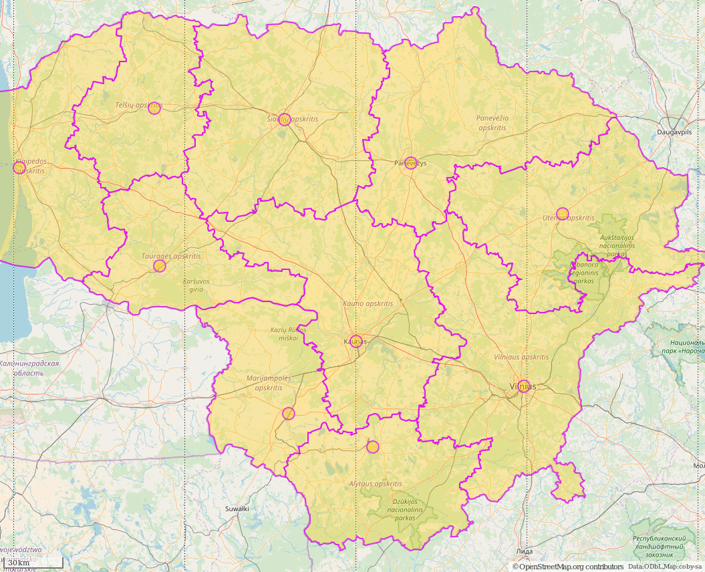
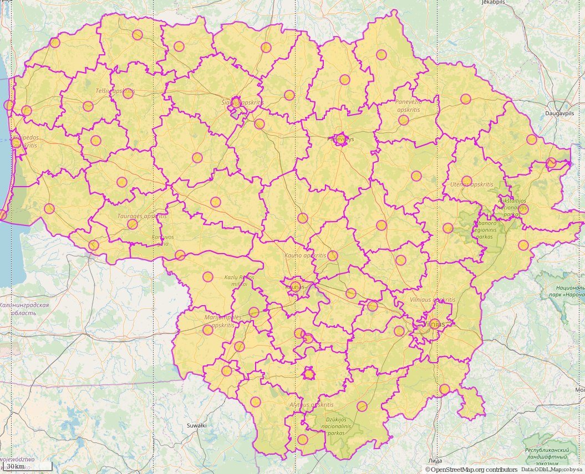

# Lithuania GeoJSON

Various level exports of lithuanian map into GeoJSON format.

Export is done from http://overpass-turbo.eu/

## Counties

Overpass query:

```
[out:json][timeout:45];
area["ISO3166-1"="LT"]->.a;
(relation(area.a)["admin_level"=4][boundary="administrative"];);
out body;
>;
out skel qt;
```

Preview:




## Municipalities

Overpass query:

```
[out:json][timeout:45];
area["ISO3166-1"="LT"]->.a;
(relation(area.a)["admin_level"=5][boundary="administrative"];);
out body;
>;
out skel qt;
```

Preview:




# License

Map data © OpenStreetMap contributors.

Data is made available using [Open Database Licence](https://www.opendatacommons.org/licenses/odbl).
