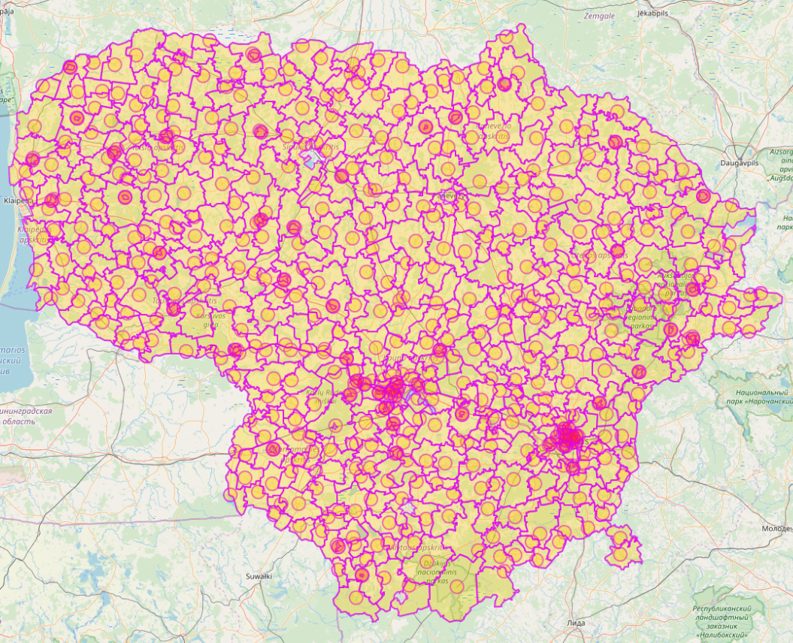

# Maps of Lithuania in GeoJSON Format

Various level exports of lithuanian administrative districts in GeoJSON format.

Exported using [Overpass](http://overpass-turbo.eu/)

## Counties (Apskritys)

Overpass query:

```
[out:json][timeout:45];
area["ISO3166-1"="LT"]->.a;
(relation(area.a)["admin_level"=4][boundary="administrative"];);
out body;
>;
out skel qt;
```

Preview:


## Municipalities (Savivaldybės)

Overpass query:

```
[out:json][timeout:45];
area["ISO3166-1"="LT"]->.a;
(relation(area.a)["admin_level"=5][boundary="administrative"];);
out body;
>;
out skel qt;
```

Preview:


## Subdistricts (Seniunijos)

Overpass query:

```
[out:json][timeout:45];
area["ISO3166-1"="LT"]->.a;
(relation(area.a)["admin_level"~"^6|10$"]["name"~"seniūnija$"][boundary="administrative"];);
out body;
>;
out skel qt;
```

Preview:



# Examples

See [example Jupyter notebook](example.ipynb).


# License

Map data © OpenStreetMap contributors.

Data is made available using [Open Database Licence](https://www.opendatacommons.org/licenses/odbl).
